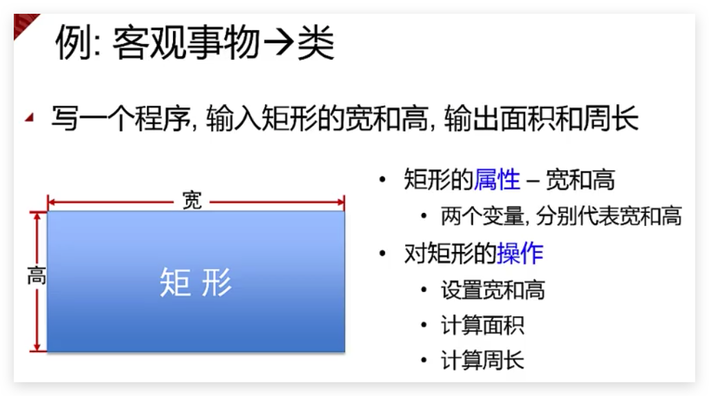

Demos for [C++程序设计(北京大学)](https://www.bilibili.com/video/av10046030/)

-   [一 从 C 走进 C++](#一-从c走进c) [(一) 函数指针](#一-函数指针)
    -   [(二) 命令行参数](#二-命令行参数)
    -   [(三) 位运算](#三-位运算)
        -   [1 定义](#1-定义)
        -   [2 按位与(&)](#2-按位与)
        -   [3 按位或(|)](#3-按位或)
        -   [4 按位异或(^)](#4-按位异或)
        -   [5 按位非(~)](#5-按位非)
        -   [6 左移(<<)](#6-左移)
        -   [7 右移(>>)](#7-右移)
        -   [8 思考题](#8-思考题)
    -   [(四) 引用](#四-引用)
    -   [(五) const 关键字(read-only)](#五-const关键字read-only)
    -   [(六) 动态内存分配](#六-动态内存分配)
    -   [(七) 内联函数, 函数重载, 函数缺省参数](#七-内联函数-函数重载-函数缺省参数)
    -   [(八) 面向对象程序设计方法](#八-面向对象程序设计方法)
    -   [(九) 面向对象语言的发展历程](#九-面向对象语言的发展历程)
    -   [(十) 从客观事物抽象出类的例子](#十-从客观事物抽象出类的例子)
    -   [(十一) 类成员的可访问范围](#十一-类成员的可访问范围)
-   [二 类和对象](#二-类和对象)
    -   [(一) 内联成员函数和重载成员函数](#一-内联成员函数和重载成员函数)
    -   [(二) 构造函数](#二-构造函数)
    -   [(三) 复制构造函数(copy constructor)](#三-复制构造函数copy-constructor)
    -   [(四) 类型转换构造函数](#四-类型转换构造函数)
    -   [(五) 析构函数 (Destructor) (见『C++ Primer』（第 5 版，中文版）第【444】页)](#五-析构函数-destructor-见c-primer第5版中文版第444页)
-   [三 运算符重载](#三-运算符重载)
-   [四 继承与派生](#四-继承与派生)
-   [五 多态与虚函数](#五-多态与虚函数)
-   [六 文件操作和模板](#六-文件操作和模板)
-   [七 标准模板库 STL-1](#七-标准模板库-stl-1)
-   [八 标准模板库 STL-2](#八-标准模板库-stl-2)
-   [九 C++高级主题和 C++11 新特性](#九-c高级主题和c11新特性)

# 一 从 C 走进 C++
## (一) 函数指针
1. 程序在运行期间, 每个函数都会占用一段连续的内存空间
2. 函数名就是该函数所占内存区域的起始地址, 可以将该地址赋值给一个指针变量. 这种指向函数的指针变量称为`函数指针`
3. qsort 库函数是应用函数指针的一个例子
    - qsort 函数签名
        ```c
        void
        qsort(void *base, size_t nel, size_t width, int (*compar)(const void *, const void *));
        ```
    - qsort 函数最后一个参数是一个函数指针, 其指向的函数签名为 `int 比较函数名(const void *elem1, const void *elem2);`
    - 比较函数编写规则
        - 如果*elem1 应该排在*elem2 前面, 则函数返回值是负整数
        - 如果*elem1 和*elem2 哪个排在前面都行, 那么函数返回 0
        - 如果*elem1 应该排在*elem2 后面, 则函数返回值是正整数

## (二) 命令行参数
1. `int main(int argc, char *argv[])`
2. `int main(int argc, char **argv)`

## (三) 位运算
### 1 定义
1. 用于对整数类型(int, char, long 等)变量中的某一位(bit)或者若干位进行操作, eg.
    - 判断某一位是否为 1
    - 只改变其中某一位, 而保持其它位都不变
2. 六大位运算操作符概览: `&, |, ^, ~, <<, >>`

### 2 按位与(&)
1. 规则
    - 只有对应的两个二进制位均为 1 时, 结果的对应二进制位才为 1, 否则为 0
2. 应用
    - [将变量中的某些位清零且同时保留其它位不变](002-bit_operation/demo01.c)
    - [获取变量中的某一位](002-bit_operation/demo02.c)

### 3 按位或(|)
1. 规则
    - 只有对应的两个二进制位均为 0 时, 结果的对应二进制位才为 0, 否则为 1
2. 应用
    - [将变量中的某些位置 1 且同时保留其它位不变](002-bit_operation/demo03.c)

### 4 按位异或(^)
1. 规则
    - 只有对应的两个二进制位不相同时 结果的对应二进制位才为 1, 否则为 0
2. 应用
    - [将变量中的某些位取反且同时保留其它位不变](002-bit_operation/demo04.c)
    - [不借助临时变量交换两个变量的值](002-bit_operation/demo06.c)
3. 特点
    - [若 a^b=c, 则有 c^b=a 及 c^a=b](002-bit_operation/demo05.c)
        - 此规律可以用来进行最简单的加密和解密

### 5 按位非(~)
1. 规则
    - 将操作数中的二进制位 0 变为 1, 1 变为 0

### 6 左移(<<)
1. 规则
    - `a<<b`
    - 将 a 各二进制位全部左移 b 位后得到的值
    - 左移时`高位丢弃, 低位补0`
    - a 的值不因运算而改变
2. 应用
    - 左移 1 位, 相等于是乘以 2; 左移 n 位, 相等于是乘以 2^n (左移操作比乘法操作快得多)

### 7 右移(>>)
1. 规则
    - `a>>b`
    - 将 a 各二进制位全部右移 b 位后得到的值
    - 右移时移出最右边的位就被丢弃
    - a 的值不因运算而改变
    - 对于有符号数, 右移时, 符号位(即最高位)将一起移动
        - 如果原符号位为 1, 则右移时高位就补充 1
        - 如果原符号位为 0, 则右移时高位就补充 0
2. 应用
    - 右移 1 位, 相等于是除以 2, 右移 n 位, 相等于是除以 2^n; 并且将结果往`小里取整`
        - -25>>4=-2; -25/(2^4)=-1.5625
        - -2>>4=-1; -2/(2^4)=-0.125
        - 18>>4=1; 18/(2^4)=1.125

### 8 思考题
-   

## (四) 引用
1. 概念: [某个变量的引用, 等价于这个变量, 相当于这个变量的`别名`](003-reference/demo01.cpp)
2. 格式: `类型名 & 引用名 = 某变量名`
3. 特点
    - 定义引用时一定要将其`初始化`成引用某个`变量`
    - [初始化后, 引用就一直引用该变量, 不会再引用别的变量了](003-reference/demo02.cpp)
    - 引用只能引用变量, 不能引用常量和表达式
4. 常引用
    - 定义引用时, 前面加 const 关键字, 即为`常引用`, const 即`read-only`
    - `const T &`和`T &`是不同的类型!!!
        - `T &`类型的引用或`T`类型的变量可以用来初始化`const T &`类型的引用
        - `const T`类型的常变量和`const T &`类型的常引用则不能用来初始化`T &`类型的引用, 除非进行`强制类型转换`
5. 例子
    - [交换两个变量](003-reference/demo03.cpp)
    - [引用作函数的返回值](003-reference/demo04.cpp)

## (五) const 关键字(read-only)
1. 定义常量
    ```c
    const int MAX_VAL = 23;
    const char *SCHOOL_NAME = "Peking University"
    ```
2. 定义常量指针
    - 不可通过常量指针修改其指向的内容
    - 不能把常量指针赋值给非常量指针; 反过来可以 (`常量指针指向的内容倾向于不被修改`)
        ```c
        const int *p1; int *p2;
        p1 = p2; // ok
        p2 = p1; // error
        p2 = (int*)p1; // ok, cast conversion
        ```
    - 函数参数为常量指针时, 可避免函数内部不小心改变参数指针所指地方的内容
3. 定义常引用
    - 不能通过常引用修改其引用的变量(见前面笔记)

## (六) 动态内存分配
1. 动态分配一个变量的存储空间
    - `p = new T;`
        - 用`new`运算符实现动态内存分配, 其返回类型为`T *`
        - T 是任意类型名; p 是类型为`T *`的指针
        - 动态分配出一片大小为`sizeof(T)`字节的内存空间, 并且将该内存空间的`起始地址`赋值给 P
        - 例子
            ```cpp
            int *pn;
            pn = new int;
            *pn = 5;
            ```
    - `delete p;`
        - 用`new`动态分配的内存空间, 一定要用`delete`运算符进行释放
        - `delete 指针;`, 该指针必须指向`new`出来的空间
        - 一片空间不能被 delete 多次
2. 动态分配一个数组的存储空间
    - `p = new T[N];`
        - T 是任意类型名; P 是类型为`T *`的指针; N 是要分配的数组元素的`个数`, 可以是整型`表达式`
        - 动态分配出一片大小为`N * sizeof(T)`字节的内存空间, 并且将该内存空间的`起始地址`赋值给 P
        - 例子
            ```cpp
            int *pn;
            int i = 5;
            pn = new int[i * 20];
            pn[0] = 20;
            ```
    - `delete[] p;`
        - `delete[] 指针;`, 该指针`必须`指向 new 出来的数组
        - 例子
            ```cpp
            int *p = new int[20];
            p[0] = 1;
            delete []p;
            ```

## (七) 内联函数, 函数重载, 函数缺省参数
1. 内联函数
    - 编译器处理对内联函数的调用语句时, 是将整个函数的代码插入到调用语句处, 而不会产生调用函数的语句和开销
    - 在函数定义前加`inline`关键字, 即可定义内联函数
2. 函数重载
    - 函数名相同而参数表不同
    - 编译器根据实参的个数和类型判断应该调用哪个函数
3. 函数的缺省参数
    - 定义函数的时候可以让`最右边的连续`若干个参数有缺省值, 那么调用函数的时候, 若相应位置不写参数, 参数就是缺省值
    - 函数参数可缺省的目的在于提高程序的可扩充性, 便于重构

## (八) 面向对象程序设计方法
1. 面向过程: `程序=数据结构(变量)+算法(函数)`
2. 面向对象: `程序=类+类+...类`

## (九) 面向对象语言的发展历程
## (十) 从客观事物抽象出类的例子
1. 一个例子
   
2. [代码](004-class_definition/demo01.cpp)
3. `类定义的变量->类的实例->"对象"`; 定义类对应变量的过程称为`实例化`
4. 对象的内存分配
    - 对象的内存空间
        - 对象的大小=所有成员变量的大小之和
        - [例子](004-class_definition/demo02.cpp)
    - 每个对象各有自己的存储空间
        - 一个对象的某个成员变量被改变, 不会影响到其它的对象
5. 对象间的运算
    - 对象之间可以用`=`进行赋值
    - 不能用`==, !=, >, <, >=, <=`进行比较, 除非这些运算符进行了`重载`
6. 访问类的成员变量和成员函数
    - 对象.成员名
    - 对象的指针->成员名
    - 对象的引用.成员名
7. 类的成员函数的另一种写法, 即`成员函数体和类的定义分开写`

    ```cpp
    class CRectangle {
        public:
             int w, h;
             int area(); // 成员函数仅在此处声明
             int perimeter();
             void init(int _w, int _h);
    };

    int CRectangle::area() {
        return w * h;
    }
    int CRectangle::perimeter() {
        return 2 * (w+h);
    }
    int CRectangle::init(int _w, int _h) {
        w = _w; h = _h;
    }
    ```

## (十一) 类成员的可访问范围
1. 关键字
    - private, 只能在`成员函数内`被访问
    - public, 可以在`任何地方`被访问
    - protected, 只能在`自己或自己的子类内`被访问
2. 三种关键字出现的次数和先后次序都没有限制
3. 定义一个类
    ```cpp
    class className {
        private:
            私有属性和函数
        public:
            公有属性和函数
        protected:
            保护属性和函数
    };
    ```
4. 缺省访问范围为`private`
5. 对象成员的访问权限
    - 类的成员函数内部, 可以访问:
        - 当前对象的全部属性和函数
        - `同类`其它对象的全部属性和函数
    - 类的成员函数以外的地方, 只能访问:
        - 该类对象的公有成员
    - 设置私有成员的目的
        - `强制`对成员变量的访问一定要通过成员函数进行
        - 隐藏 -> 封装

# 二 类和对象
## (一) 内联成员函数和重载成员函数
1. 内联成员函数的两种定义方式

    - inline + 成员函数
    - 整个函数体出现在类定义内部
    - 例子:

        ```cpp
        class B {
            inline void func1(); // 内联函数
            void func2() { // 内联函数

            };
        };
        void B::func1(){}
        ```

2. 成员函数的重载以及参数缺省
    - 重载成员函数
    - 成员函数带缺省参数
    - 使用缺省参数要注意避免有函数重载时的二义性
    - 例子:
        ```cpp
        #include <iostream>
        using namespace std;
        class Location {
            private:
              int x, y;
            public:
              void init(int x=0, int y=0);
              void valueX(int val) { x= val; }
              int valueX() { return x; }
        };
        void Location::init(int X, int Y) {
            x = X;
            y = Y;
        }
        ```

## (二) 构造函数
1. 构造函数是成员函数的一种
2. 构造函数的名字与类名相同, 可以有参数, 不能有返回值(void 也不行)
3. 构造函数的作用是`对对象进行初始化, 如给成员变量赋初值`
4. [如定义类时没写构造函数, 则编译器生成一个默认的`无参数`的构造函数](005-005-constructor/demo01.cpp)
    - 默认构造函数无参数, 不做任何操作
    - 如果定义了构造函数, 则编译器不生成默认的无参数的构造函数
5. `对象生成时构造函数自动被调用. 对象一旦生成, 就再也不能在其上执行构造函数`
6. 一个类可以有多个构造函数, 多个构造函数可以构成`重载函数`
7. 构造函数在数组中的使用
    - [例子 1](005-constructor/demo02.cpp)
    - [例子 2](005-constructor/demo03.cpp)

## (三) 复制构造函数(copy constructor)
1. `复制构造函数`只有一个参数, 即`对同类对象的引用`
2. `复制构造函数在一个类中只能有一个`; 形如`X::X(X&)`或`X::X(const X &)`, 二者选一, 后者能以常量对象作为参数
3. [如果没有定义复制构造函数, 那么编译器生成`默认复制构造函数`. 默认的复制构造函数完成复制功能](005-constructor/demo04.cpp)
4. [如果定义了自己的复制构造函数, 则默认的复制构造函数不存在](005-constructor/demo05.cpp)
5. 复制构造函数起作用的三种情况
    - 当用一个对象去初始化同类的另一个对象时
        ```cpp
        Complex c2(c1);
        Complex c2 = c1; // 与上句等价, 这是一条初始化语句, 非赋值语句
        ```
    - [如果某个函数有一个参数是类 A 的对象, 那么该函数被调用时, 类 A 的复制构造函数将被调用](005-constructor/demo06.cpp)
    - [如果某个函数的返回值是类 A 的对象时, 则函数返回时, A 的复制构造函数被调用](005-constructor/demo07.cpp)

## (四) 类型转换构造函数
1. 目的: 实现类型的自动转换
2. 特点
    - 只有一个参数
    - 不是复制构造函数
3. [编译系统在适当的时候会自动调用转换构造函数, 建立一个临时对象/临时变量](005-constructor/demo08.cpp)

## (五) 析构函数 (Destructor) (见『C++ Primer』（第 5 版，中文版）第【444】页)
1. 成员函数的一种
    - 名字与类名相同
    - 在前面加`~`
    - 没有参数和返回值
    - 一个类`最多只有一个`析构函数
2. [`对象消亡时`析构函数会被自动调用](006-destructor/demo01.cpp)
    - 在对象消亡前做善后工作
      - 释放分配的空间等
    - 定义类时没写析构函数, 则编译器会生成`缺省析构函数`
      - 不会释放用户申请的内存空间
    - 若程序员定义了析构函数, 则编译器不生成缺省的析构函数
3. 析构函数和数组
    - [对象数组生命期结束时, 对象数组的每个元素的析构函数都会被调用](006-destructor/demo02.cpp)
4. 构造函数和运算符delete
    - [delete运算符导致析构函数调用](006-destructor/demo03.cpp)

# 三 运算符重载

# 四 继承与派生

# 五 多态与虚函数

# 六 文件操作和模板

# 七 标准模板库 STL-1

# 八 标准模板库 STL-2

# 九 C++高级主题和 C++11 新特性
