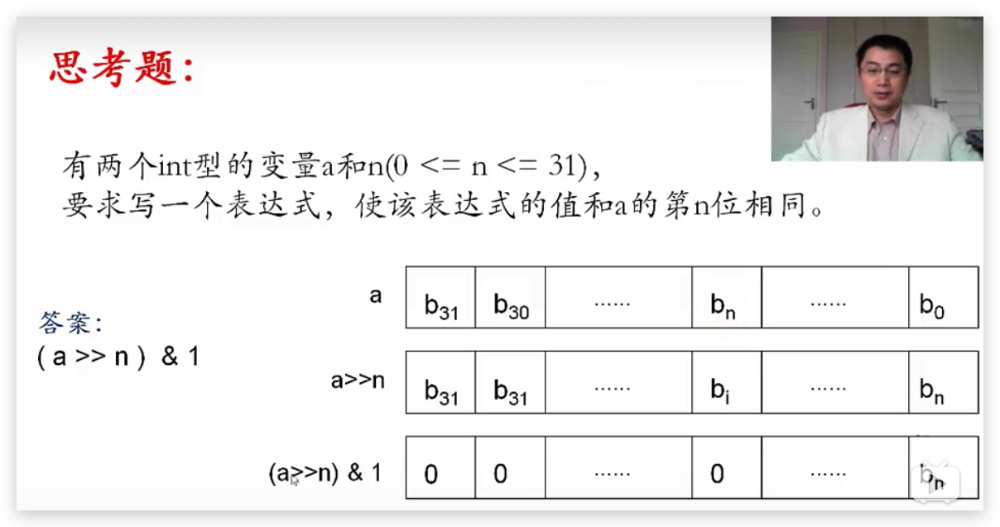

Demos for [C++程序设计(北京大学)](https://www.bilibili.com/video/av10046030/)

- [一 从C走进C++](#一-从c走进c)
  - [(一) 函数指针](#一-函数指针)
  - [(二) 命令行参数](#二-命令行参数)
  - [(三) 位运算](#三-位运算)
    - [1 定义](#1-定义)
    - [2 按位与(&)](#2-按位与)
    - [3 按位或(|)](#3-按位或)
    - [4 按位异或(^)](#4-按位异或)
    - [5 按位非(~)](#5-按位非)
    - [6 左移(<<)](#6-左移)
    - [7 右移(>>)](#7-右移)
    - [8 思考题](#8-思考题)
  - [(四) 引用](#四-引用)
  - [(五) const关键字](#五-const关键字)
# 一 从C走进C++
## (一) 函数指针
1. 程序在运行期间, 每个函数都会占用一段连续的内存空间
2. 函数名就是该函数所占内存区域的起始地址, 可以将该地址赋值给一个指针变量. 这种指向函数的指针变量称为`函数指针`
3. qsort库函数是应用函数指针的一个例子
    - qsort函数签名
        ```c
        void
        qsort(void *base, size_t nel, size_t width, int (*compar)(const void *, const void *));
        ```
    - int 比较函数名(const void *elem1, const void *elem2);
    - 比较函数编写规则
        - 如果*elem1应该排在*elem2前面, 则函数返回值是负整数
        - 如果*elem1和*elem2哪个排在前面都行, 那么函数返回0
        - 如果*elem1应该排在*elem2后面, 则函数返回值是正整数
## (二) 命令行参数
1. `int main(int argc, char *argv[])`
2. `int main(int argc, char **argv)`
## (三) 位运算
### 1 定义
1. 用于对整数类型(int, char, long等)变量中的某一位(bit)或者若干位进行操作, eg.
    - 判断某一位是否为1
    - 只改变其中某一位, 而保持其它位都不变
2. 六大位运算操作符概览: `&, |, ^, ~, <<, >>`
### 2 按位与(&)
1. 规则
    - 只有对应的两个二进制位均为1时, 结果的对应二进制位才为1, 否则为0
2. 应用
    - [将变量中的某些位清零且同时保留其它位不变](002-bit_operation/demo01.c)
    - [获取变量中的某一位](002-bit_operation/demo02.c)
### 3 按位或(|)
1. 规则
    - 只有对应的两个二进制位均为0时, 结果的对应二进制位才为0, 否则为1
2. 应用
    - [将变量中的某些位置1且同时保留其它位不变](002-bit_operation/demo03.c)
### 4 按位异或(^)
1. 规则
    - 只有对应的两个二进制位不相同时 结果的对应二进制位才为1, 否则为0
2. 应用
    - [将变量中的某些位取反且同时保留其它位不变](002-bit_operation/demo04.c)
    - [不借助临时变量交换两个变量的值](002-bit_operation/demo06.c)
3. 特点
    - [若`a^b=c`, 则`c^b=a`及`c^a=b`](002-bit_operation/demo05.c)
        - 此规律可以用来进行最简单的加密和解密
### 5 按位非(~)
1. 规则
    - 将操作数中的二进制位0变为1, 1变为0
### 6 左移(<<)
1. 规则
    - `a<<b`
    - 将a各二进制位全部左移b位后得到的值
    - 左移时`高位丢弃, 低位补0`
    - a的值不因运算而改变
2. 应用
    - 左移1位, 相等于是乘以2; 左移n位, 相等于是乘以2^n (左移操作比乘法操作快得多)
### 7 右移(>>)
1. 规则
    - `a>>b`
    - 将a各二进制位全部右移b位后得到的值
    - 右移时移出最右边的位就被丢弃
    - a的值不因运算而改变
    - 对于有符号数, 右移时, 符号位(即最高位)将一起移动
        - 如果原符号位为1, 则右移时高位就补充1
        - 如果原符号位为0, 则右移时高位就补充0
2. 应用
    - 右移1位, 相等于是除以2, 右移n位, 相等于是除以2^n; 并且将结果往`小里取整`
        - -25>>4=-2; -25/(2^4)=-1.5625
        - -2>>4=-1; -2/(2^4)=-0.125
        - 18>>4=1; 18/(2^4)=1.125
### 8 思考题
- 
## (四) 引用
1. 概念: [某个变量的引用, 等价于这个变量, 相当于这个变量的`别名`](003-reference/demo01.cpp)
2. 格式: `类型名 & 引用名 = 某变量名`
3. 特点
    - 定义引用时一定要将其`初始化`成引用某个`变量`
    - [初始化后, 引用就一直引用该变量, 不会再引用别的变量了](003-reference/demo02.cpp)
    - 引用只能引用变量, 不能引用常量和表达式
4. 常引用
    - 定义引用时, 前面加const关键字, 即为`常引用`, const即`read-only`
    - `const T &`和`T &`是不同的类型!!!
        - `T &`类型的引用或`T`类型的变量可以用来初始化`const T &`类型的引用
        - `const T`类型的常变量和`const T &`类型的常引用则不能用来初始化`T &`类型的引用, 除非进行`强制类型转换`
5. 例子
    - [交换两个变量](003-reference/demo03.cpp)
    - [引用作函数的返回值](003-reference/demo04.cpp)
## (五) const关键字
1. 定义常量


